# Zero-Hallucination Clinical Extraction API

A production-grade, Google-style monolithic API service for structurally parsing medical transcripts into EESZT-compliant clinical records and patient-native summaries. Utilizing strict, deterministic pipelines for zero LLM confabulation.

## 1. System Architecture & Data Flow

The backend employs a strict, linear progression to mathematically guarantee that all output clinical data is precisely derived from the audio transcript, while bypassing PII completely.

```mermaid
sequenceDiagram
    participant F as Frontend (UI/Device)
    participant E as EESZT API
    participant B as Backend (FastAPI)
    participant P as Presidio (Local Scrub)
    participant L as Azure OpenAI (EU)

    F->>E: Authenticate & Fetch Opaque IDs (No EHR Data)
    E-->>F: Returns [{"type": "lab", "id": "DOC-XYZ"}]
    Note over F: Doctor records consultation audio
    F->>F: Whisper (Speech-to-Text) -> Transcript
    F->>B: POST /generate-consultation<br>(Metadata + Opaque IDs + Transcript)
    
    rect rgb(20, 20, 30)
    Note over B: Deterministic Zone
    B->>P: Scrub PII (Names, Dates, Locations)
    P-->>B: Scrubbed Transcript + Token Map [PERSON_1]
    B->>L: CoVe Prompt + Scrubbed Transcript + Opaque IDs
    L-->>B: Structured JSON (with contextual_quote)
    B->>B: Deterministic Guardrail:<br>transcript.find(contextual_quote)
    B->>L: Translate Validated JSON to Patient Summary
    L-->>B: Layman Summary JSON
    B->>P: Hydrate JSON (Swap [PERSON_1] -> "Jane Doe")
    end
    
    B-->>F: FinalReportResponse (Clinical + Summary + Metadata)
    F->>E: POST Structured Clinical JSON -> EHR
    Note over F: UI renders laymen summary deep-linked<br>to EESZT via "DOC-XYZ"
```



### Deterministic Sub-Systems

1.  **PII Mitigation**: An Edge-layer Microsoft `Presidio` instance tokenizes local data (GDPR Art 9 compliance) before LLM inference.
2.  **Metadata Bypass & Opaque Pointers**: Strict HTTP ingestion parameters skip the AI reasoning loop directly. Historical EESZT documents are passed as "opaque pointers" (IDs only) in the system prompt context. No real PII/PHI EHR data enters the LLM context pane. 
3.  **Verifiable Grounding via CoVe**: `gpt-5.2` structured outputs are linked to `Pydantic` Chain-of-Verification schemas, forcing logical deduction explicitly *before* final extraction.
4.  **Deterministic Guardrails**: Output JSONs are mathematically validated. Any data point where `transcript.find(contextual_quote) == -1` is structurally removed to guarantee zero hallucination.

---

## 2. API Contract & Schemas

The backend exposes a single, highly optimized endpoint handling the linear consultation pipeline.

### `POST /api/v1/generate-consultation`

#### How the EESZT Integration Works (The Opaque Pointer Pattern)

The core challenge is linking a spoken phrase (like *"my lab results from last Tuesday"*) to an actual Hungarian National eHealth (EESZT) database entry *without* downloading the patient's entire medical history into the API pipeline (which violates GDPR minimize data principles).

**The Solution:**
1.  **Frontend Context Gathering**: When the doctor opens the patient's record, the Frontend UI makes a secure API call to EESZT to fetch a lightweight index of recent documents. It retrieves **only** the document ID, the type, and the date. No actual medical contents.
2.  **The API Payload**: The Frontend sends this lightweight index to our backend as `context_documents` within the `metadata` object.
3.  **Semantic Mapping via LLM**: The Backend injects this lightweight index directly into the LLM's system prompt (e.g., *"Available Documents: ID: DOC-99281-XYZ, Type: laboratory_result, Date: 2026-02-20"*).
4.  **The Inference Link**: When the LLM processes the transcript ("Patient complains her blood pressure is higher than her latest lab results indicated"), its native semantic understanding connects "latest lab results" to the "laboratory_result" type in the prompt context. 
5.  **The Output**: The LLM outputs `DOC-99281-XYZ` in the structured JSON field `system_reference_id` alongside the finding.
6.  **Frontend Hydration**: The Backend returns the JSON. The Frontend UI sees `system_reference_id: "DOC-99281-XYZ"`, and generates a dynamic hyperlink in the final clinical report, allowing the doctor to click it and securely open the actual lab document directly from EESZT on their device.


#### Request Payload Example
```json
{
  "metadata": {
    "patient_id": "P-10101",
    "patient_name": "Jane Doe",
    "patient_taj": "123-456-789",
    "doctor_id": "D-4099",
    "doctor_name": "Dr. Smith",
    "doctor_seal": "S-14399",
    "encounter_date": "2026-02-27T10:00:00Z",
    "context_documents": [
      {
        "type": "laboratory_result",
        "eeszt_doc_id": "DOC-99281-XYZ",
        "date": "2026-02-20"
      },
      {
         "type": "discharge_summary",
         "eeszt_doc_id": "DOC-55555-ABC",
         "date": "2025-11-01"
      }
    ]
  },
  "transcript": "Okay Jane, I see from your latest lab results last week that your cholesterol is slightly elevated. Otherwise, you're recovering well from your hospital stay in November. Let's schedule a follow-up appointment for next month to re-check."
}
```

#### Deterministic Response Payload Output
```json
{
  "administrative_metadata": {
    "patient_id": "P-10101",
    "patient_name": "Jane Doe",
    "patient_taj": "123-456-789",
    "doctor_id": "D-4099",
    "doctor_name": "Dr. Smith",
    "doctor_seal": "S-14399",
    "encounter_date": "2026-02-27T10:00:00Z"
  },
  "clinical_report": {
    "chief_complaints": [],
    "assessments": [
      {
        "finding": "Elevated Cholesterol",
        "condition_status": "CONFIRMED",
        "subject": "PATIENT",
        "exact_quote": "cholesterol is slightly elevated",
        "contextual_quote": "latest lab results last week that your cholesterol is slightly elevated.",
        "system_reference_id": "DOC-99281-XYZ" 
      }
    ],
    "medications": [
      {
         "action_type": "FOLLOW_UP_APPT",
         "description": "Schedule a follow-up to check cholesterol",
         "timeframe": "Next month",
         "system_reference_id": null,
         "exact_quote": "follow-up appointment for next month",
         "contextual_quote": "Let's schedule a follow-up appointment for next month to re-check."
      }
    ]
  },
  "patient_summary": {
    "layman_explanation": "Jane, we reviewed your recent laboratory tests and found your cholesterol is slightly high. The good news is you are recovering well from your hospital stay last November.",
    "actionables": [
       {
         "action_type": "FOLLOW_UP_APPT",
         "description": "Please schedule your next appointment to monitor your cholesterol levels.",
         "timeframe": "Next month",
         "system_reference_id": null,
         "exact_quote": "follow-up appointment for next month",
         "contextual_quote": "Let's schedule a follow-up appointment for next month to re-check."
       }
    ]
  }
}
```

### Constraints Enforcement
To ensure LLM compliance, string literals are strictly constrained to Enums:
- **`condition_status`**: `["CONFIRMED", "NEGATED", "SUSPECTED", "UNKNOWN"]`
- **`subject`**: `["PATIENT", "FAMILY_MEMBER"]`
- **`action_type`**: `["PHARMACY_PICKUP", "FOLLOW_UP_APPT", "LIFESTYLE_CHANGE", "LAB_TEST", "OTHER"]`

---

## 3. Environment & Deployment

This service strictly targets hermetic, deterministic virtualization utilizing `uv` running **Python 3.12**.

### Initialization
```bash
# Execute within the backend directory
uv python install 3.12 
./setup.sh
```

### Configuration (`../.env`)
Required `.env` execution variables (housed in the repository root):
```env
OPENAI_API_KEY=your_key
AZURE_OPENAI_ENDPOINT=https://your-resource.openai.azure.com/
AZURE_OPENAI_API_VERSION=2024-12-01-preview
AZURE_OPENAI_DEPLOYMENT_NAME=gpt-5.2
```

### Execution
```bash
# Executing strictly inside the lockfile sandbox
uv run python main.py
```
> Server spins up via `uvicorn` on `localhost:8000`. Hot-reloading enabled.

### Verification
```bash
# Execute functional schemas and pipeline validation
uv run pytest
```
