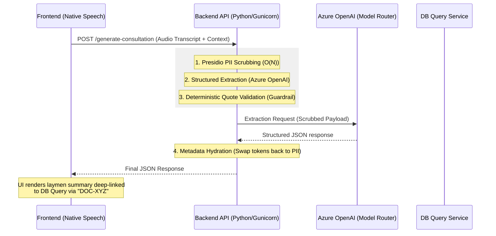

# Zero-Hallucination Clinical Extraction API

A production-grade, Google-style monolithic API service for structurally parsing medical transcripts into database-compliant clinical records and patient-native summaries. Utilizing strict, deterministic pipelines for zero LLM confabulation.

## 1. System Architecture & Data Flow

The backend employs a strict, linear progression to mathematically guarantee that all output clinical data is precisely derived from the audio transcript, while bypassing PII completely.



###  Deployment Security & Precision Architecture

1.  **PII Scrubbing (Local Execution)**: We utilize Microsoft Presidio to locally redact all PERSON, LOCATION, and DATE_TIME entities on the backend before the payload leaves our infrastructure.
2.  **Metadata Bypass & Opaque Pointers**: Strict HTTP ingestion parameters skip the AI reasoning loop directly. Historical documentation are passed as "opaque pointers" (IDs only) in the system prompt context. No real PII/PHI EHR data enters the LLM context pane. 
3.  **Deterministic Literal Matching**: The "Zero-Hallucination" guardrail verifies that every clinical finding contains a literal 1-to-1 contextual quote proven to exist in the scrubbed transcript. If the LLM generates a finding not present in the record, the backend strips it deterministically.

---

#### How the DB Query Integration Works (The Opaque Pointer Pattern)

The core challenge is linking a spoken phrase (like *"my lab results from last Tuesday"*) to an actual medical database entry *without* downloading the patient's entire medical history into the API pipeline (which violates GDPR minimize data principles).

1.  **Frontend Context Gathering**: When the doctor opens the patient's record, the Frontend UI makes a secure API call to a DB Query service to fetch a lightweight index of recent documents. It retrieves **only** the document ID, the type, and the date. No actual medical contents.
2.  **API Ingestion**: The Backend receives the JSON index during the request.
3.  **Prompt Contextualization**: The LLM is given the index (the "System Context"). 
4.  **Semantic Mapping**: In the transcript, when the doctor says *"Your cholesterol is high from your lab last Tuesday"*, the LLM realizes *"Tue, Feb 20"* matches a document in the context, and maps it.
5.  **Opaque Pointer Output**: The LLM outputs `system_reference_id: "DOC-99281-XYZ"`.
6.  **Frontend Hydration**: The Backend returns the JSON. The Frontend UI sees `system_reference_id: "DOC-99281-XYZ"`, and generates a dynamic hyperlink in the final clinical report, allowing the doctor to click it and securely open the actual lab document directly from a secure DB Query endpoint on their device.

---

###  API Documentation & Examples

#### Endpoint: `POST /api/v1/generate-consultation`

**Request Body Schema:**
```json
{
  "metadata": {
    "patient_id": "P-88421",
    "patient_taj": "111-222-333",
    "encounter_date": "2026-02-27T10:00:00Z",
    "context_documents": [
      {
        "type": "laboratory_result",
        "system_doc_id": "DOC-99281-XYZ",
        "date": "2026-02-20"
      },
      {
         "type": "surgical_note",
         "system_doc_id": "DOC-55555-ABC",
         "date": "2025-12-14"
      }
    ]
  },
  "transcript": "Okay, I see from your laboratory result that your cholesterol is slightly elevated..."
}
```

#### Deterministic Response Payload Output
```json
{
  "administrative_metadata": {
    "patient_id": "P-10101",
    "patient_name": "Jane Doe",
    "patient_taj": "123-456-789",
    "doctor_id": "D-4099",
    "doctor_name": "Dr. Smith",
    "doctor_seal": "S-14399",
    "encounter_date": "2026-02-27T10:00:00Z"
  },
  "clinical_report": {
    "chief_complaints": [],
    "assessments": [
      {
        "finding": "Elevated Cholesterol",
        "condition_status": "CONFIRMED",
        "subject": "PATIENT",
        "exact_quote": "cholesterol is slightly elevated",
        "contextual_quote": "latest lab results last week that your cholesterol is slightly elevated.",
        "system_reference_id": "DOC-99281-XYZ" 
      }
    ],
    "actionables": [
      {
         "action_type": "FOLLOW_UP_APPT",
         "description": "Schedule a cardiology follow-up with Dr. Sarah Miller.",
         "timeframe": "Next Thursday",
         "system_reference_id": "SPEC-01",
         "exact_quote": "Dr. Sarah Miller"
      }
    ]
  },
  "patient_summary": {
    "layman_explanation": "Jane, we reviewed your recent laboratory tests and found your cholesterol is slightly high. The good news is you are recovering well from your hospital stay last November.",
    "actionables": [
       {
         "action_type": "FOLLOW_UP_APPT",
         "description": "Please schedule your next appointment to monitor your cholesterol levels.",
         "timeframe": "Next month",
         "system_reference_id": null,
         "exact_quote": "follow-up appointment for next month",
         "contextual_quote": "Let's schedule a follow-up appointment for next month to re-check."
       }
    ]
  }
}
```

### Constraints Enforcement
To ensure LLM compliance, string literals are strictly constrained to Enums:
- **`condition_status`**: `["CONFIRMED", "NEGATED", "SUSPECTED", "UNKNOWN"]`
- **`subject`**: `["PATIENT", "FAMILY_MEMBER"]`
- **`action_type`**: `["PHARMACY_PICKUP", "FOLLOW_UP_APPT", "LIFESTYLE_CHANGE", "LAB_TEST", "OTHER"]`

---

## 3. Environment & Deployment

This service strictly targets hermetic, deterministic virtualization utilizing `uv` running **Python 3.12**.

### Initialization
```bash
# Execute within the backend directory
uv python install 3.12 
./setup.sh
```

### Configuration (`../.env`)
Required `.env` execution variables (housed in the repository root):
```env
OPENAI_API_KEY=your_key
AZURE_OPENAI_ENDPOINT=https://your-resource.openai.azure.com/
AZURE_OPENAI_API_VERSION=2024-12-01-preview
AZURE_OPENAI_DEPLOYMENT_NAME=gpt-5.2
```

### Execution
```bash
# Executing strictly inside the lockfile sandbox
uv run python main.py
```
> Server spins up via `uvicorn` on `localhost:8000`. Hot-reloading enabled.

### Verification
```bash
# Execute functional schemas and pipeline validation
uv run pytest
```
