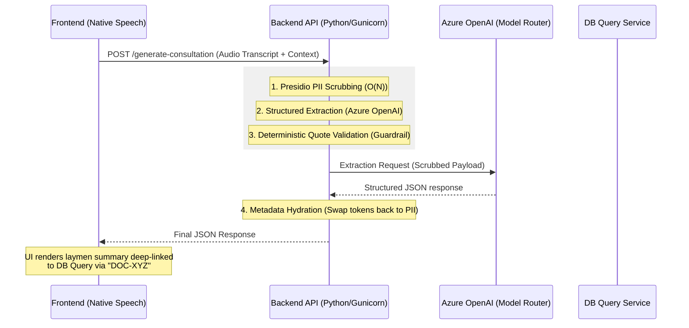

# Zero-Hallucination Clinical Extraction API

A production-grade, Google-style monolithic API service for structurally parsing medical transcripts into database-compliant clinical records and patient-native summaries. Utilizing strict, deterministic pipelines for zero LLM confabulation.

## 1. System Architecture & Data Flow

The backend employs a strict, linear progression to mathematically guarantee that all output clinical data is precisely derived from the audio transcript, while bypassing PII completely.



###  Deployment Security & Precision Architecture

1.  **PII Scrubbing (Local Execution)**: We utilize Microsoft Presidio to locally redact all PERSON, LOCATION, and DATE_TIME entities on the backend before the payload leaves our infrastructure.
2.  **Metadata Bypass & Opaque Pointers**: Strict HTTP ingestion parameters skip the AI reasoning loop directly. Historical documentation are passed as "opaque pointers" (IDs only) in the system prompt context. No real PII/PHI EHR data enters the LLM context pane. 
3.  **Deterministic Literal Matching**: The "Zero-Hallucination" guardrail verifies that every clinical finding contains a literal 1-to-1 contextual quote proven to exist in the scrubbed transcript. If the LLM generates a finding not present in the record, the backend strips it deterministically.

---

#### How the DB Query Integration Works (The Opaque Pointer Pattern)

The core challenge is linking a spoken phrase (like *"my lab results from last Tuesday"*) to an actual medical database entry *without* downloading the patient's entire medical history into the API pipeline (which violates GDPR minimize data principles).

1.  **Frontend Context Gathering**: When the doctor opens the patient's record, the Frontend UI makes a secure API call to a DB Query service to fetch a lightweight index of recent documents. It retrieves **only** the document ID, the type, and the date. No actual medical contents.
2.  **API Ingestion**: The Backend receives the JSON index during the request.
3.  **Prompt Contextualization**: The LLM is given the index (the "System Context"). 
4.  **Semantic Mapping**: In the transcript, when the doctor says *"Your cholesterol is high from your lab last Tuesday"*, the LLM realizes *"Tue, Feb 20"* matches a document in the context, and maps it.
5.  **Opaque Pointer Output**: The LLM outputs `system_reference_id: "DOC-99281-XYZ"`.
6.  **Frontend Hydration**: The Backend returns the JSON. The Frontend UI sees `system_reference_id: "DOC-99281-XYZ"`, and generates a dynamic hyperlink in the final clinical report, allowing the doctor to click it and securely open the actual lab document directly from a secure DB Query endpoint on their device.

---

###  API Specification (Contractual)

The Mesh API enforces a strict Pydantic-validated contract. All timestamps follow ISO 8601.

#### Request Schema: `POST /api/v1/generate-consultation` (Multipart Form-Data)

| Field | Type | Constraint | Description |
| :--- | :--- | :--- | :--- |
| **`patient_id`** | `string` | Required | Unique system identifier for the patient. Used to fetch DB context. |
| **`doctor_id`** | `string` | Required | Healthcare provider identifier. Used for referral mapping. |
| **`encounter_date`** | `string` | ISO 8601 | Current visit timestamp (UTC). |
| **`format_id`** | `string` | Default: `fmt_001` | Report format ID. |
| **`audio`** | `File` | Required | Audio dictation file (`.wav`, `.webm`, etc.). Automatically transcoded to 16kHz WAV. |

#### Response Schema: `OrchestrationResponse` (JSON)

| Field | Type | Description |
| :--- | :--- | :--- |
| **`medical_report_pdf_url`** | `string` | URL to the statically served PDF medical report. |
| **`patient_summary_md`** | `string` | Human-readable layman explanation in Markdown format. |
| **`administrative_metadata`** | `object` | Mirror of input metadata. |

---

#### Endpoint: `POST /api/v1/generate-consultation`

**Request Example (using `curl`):**
```bash
curl -X POST "http://localhost:8000/api/v1/generate-consultation" \
  -F "patient_id=P-001" \
  -F "doctor_id=D-99" \
  -F "encounter_date=2026-02-28T10:00:00Z" \
  -F "format_id=fmt_001" \
  -F "audio=@/path/to/recording.wav"
```

#### API Response Payload Output
```json
{
  "medical_report_pdf_url": "/outputs/medical_report_P-001.pdf",
  "patient_summary_md": "# Patient Summary: Jean-Pierre de La-Fontaine\n\nYour visit today...",
  "administrative_metadata": {
    "patient_id": "P-001",
    "doctor_id": "D-99",
    "encounter_date": "2026-02-28T10:00:00Z",
    "format_id": "fmt_001"
  }
}
```
---

## 3. Environment & Deployment

This service strictly targets hermetic, deterministic virtualization utilizing `uv` running **Python 3.12**.

### Initialization
```bash
# Execute within the backend directory
uv python install 3.12 
./setup.sh
```

### Configuration (`../.env`)
Required `.env` execution variables (housed in the repository root):
```env
OPENAI_API_KEY=your_key
AZURE_OPENAI_ENDPOINT=https://your-resource.openai.azure.com/
AZURE_OPENAI_API_VERSION=2024-12-01-preview
AZURE_OPENAI_DEPLOYMENT_NAME=gpt-5.2
```

### Execution
```bash
# Executing from the root of the project to boot the Database, API, and Frontend concurrently:
../start.sh
```
> Server spins up via `uvicorn` on `localhost:8000`. Fast/automatic conversion to `.wav` requires `ffmpeg` installed on the system.
### Verification
```bash
# Execute functional schemas and pipeline validation
uv run pytest
```
