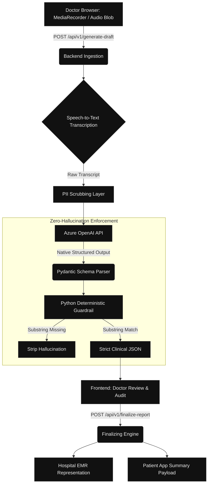

# Architecture: Zero-Hallucination Engine

Echo's paramount engineering directive is absolute factual accuracy. We transform noisy human dialogue into deterministic, database-safe records. This is achieved via our **Schema-Enforced Extraction** pipeline, powered natively by **Azure OpenAI Structured Outputs**.

## Pipeline Flow



## Implementing Zero-Hallucination

Traditional LLMs generate tokens probabilistically. We bypass this by forcing the model to reply exclusively via OpenAI's `beta.chat.completions.parse` method, which guarantees the structure physically matches our `pydantic` schemas.

```python
# snippet from backend/app/models/llm_schemas.py
class ClinicalDraftJson(BaseModel):
    chief_complaints: List[ClinicalFinding] = Field(
        ..., description="Patient's primary reasons for the visit."
    )
    assessments: List[ClinicalFinding] = Field(...)
    actionables: List[ActionableItem] = Field(...)
```

The core of the architecture lies inside the sub-schemas. Every generated clinical claim requires a verified proof of origin:

```python
class ClinicalFinding(BaseModel):
    finding: str = Field(..., description="The clinical claim.")
    exact_quote: str = Field(
        ..., 
        description="CRITICAL: The literal, perfect 1-to-5 word substring from the transcript."
    )
```

Once the LLM returns the parsed Pydantic object, our backend executes a **Deterministic Guardrail** (inside `ZeroHallucinationPipeline.validate_quotes`). This is a zero-tolerance Python validation step:

```python
# The Deterministic Guardrail Check
exists = scrubbed_transcript.find(quote) != -1
if not exists:
    logger.warning(f"Guardrail Trip: Hallucinated quote stripped: '{quote}'")
```

If the model hallucinates a fact—meaning the specific word was never physically spoken—the substring check fails (`-1`), and the entire extraction node is dropped from the report. Because this validation uses native `string.find()`, it is computationally trivial, requires zero additional LLM latency, and is mathematically infallible. This surfaces an unbroken, transparent audit trail directly to the physician in the frontend UI.
