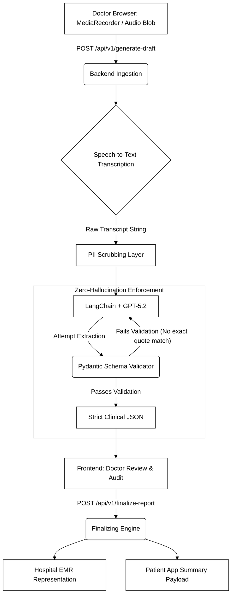

# Architecture: Zero-Hallucination Engine

Echo's paramount engineering directive is absolute factual accuracy. We transform noisy human dialogue into deterministic, database-safe records. This is achieved via our **Schema-Enforced Extraction** pipeline, powered by **GPT-5.2**.

## Pipeline Flow



## Implementing Zero-Hallucination

Traditional LLMs generate tokens probabilistically. We bypass this by forcing **GPT-5.2** to call internal tools structured by `pydantic`. The model is stripped of its ability to use "filler" or "generative" vocabulary.

```python
# snippet from backend/app/models/llm_schemas.py
class ClinicalDraftJson(BaseModel):
    chief_complaints: List[ClinicalFinding] = Field(
        ..., description="Patient's primary reasons for the visit."
    )
    assessments: List[ClinicalFinding] = Field(...)
    actionables: List[ActionableItem] = Field(...)
```

The core of the architecture lies inside the sub-schemas. Every generated clinical claim requires a verified proof of origin:

```python
class ClinicalFinding(BaseModel):
    finding: str = Field(..., description="The clinical claim.")
    exact_quote: str = Field(
        ..., 
        description="CRITICAL: The literal, perfect 1-to-5 word substring from the transcript."
    )
```

Because the validator aggressively parses the `exact_quote` against the initial audio transcript, the LLM is artificially constrained. If the model hallucinates a fact—meaning the specific word was never physically spoken—the substring check fails, and the extraction is dropped. This surfaces an unbroken, transparent audit trail directly to the physician in the frontend UI.
