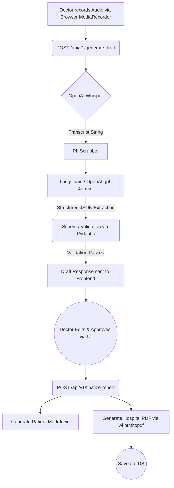

# System Architecture: The Zero-Hallucination Engine

Mesh’s primary backend engineering objective is to turn fuzzy, unstructured human dialogue into deterministic, safely typable database records. We achieve this through a process known as **Schema-Enforced Extraction**, wrapped in an audit layer.

## The Data Flow



## Pydantic Core

We utilize `pydantic` to enforce the shape of the LLM output. OpenAI's function-calling mechanics natively support this. By refusing to let the LLM reply with a raw string, we strip away its ability to use "filler" vocabulary.

```python
# From backend/app/models/llm_schemas.py
class ClinicalDraftJson(BaseModel):
    chief_complaints: List[ClinicalFinding] = Field(
        ..., description="List of the patient's primary reasons for the visit."
    )
    assessments: List[ClinicalFinding] = Field(
        ..., description="The physician's diagnoses or assessments."
    )
    actionables: List[ActionableItem] = Field(
        ..., description="Specific next steps, prescriptions, or referrals."
    )
```

## The Audit Trail (`exact_quote`)

The secret to our Zero-Hallucination guarantee lies within the sub-schemas. Every `ClinicalFinding` must include an `exact_quote`.

```python
class ClinicalFinding(BaseModel):
    finding: str = Field(..., description="The core clinical fact (e.g., 'Hypertension').")
    condition_status: str = Field(..., description="E.g., newly diagnosed, worsening, stable.")
    exact_quote: str = Field(
        ..., 
        description="CRITICAL: The exact, literal 1-to-5 word phrase from the transcript that proves this finding. Must be a perfect substring match."
    )
```

The frontend uses this `exact_quote` to power the Hover UI. Because the LLM understands it will fail the schema validation if it cannot extract a perfect substring match, it *drastically* reduces the likelihood of it hallucinating facts out of thin air. You cannot provide a substring quote for a word that wasn't spoken.
